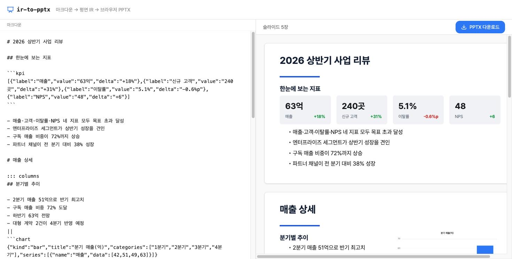

# ir-to-pptx

마크다운을 좌표까지 계산된 평면 IR(JSON)로 바꿔 내려주는 FastAPI 백엔드와, 그 IR로 브라우저에서 PPTX 파일을 만드는 React 프론트로 이루어져 있다.

서버는 파일을 만들지 않는다. 좌표는 서버가 한 번 계산하고, 그림은 브라우저가 그린다.



```
마크다운  ──►  FastAPI 레이아웃 엔진  ──►  평면 IR(JSON)  ─┬─►  DOM 미리보기
                                                    └─►  pptxgenjs → .pptx 다운로드
```

미리보기와 파일은 같은 IR을 받는다. 그래서 화면에 보이는 대로 파일이 나온다.

## 실행

```bash
docker compose up
# http://localhost:8000
```

왼쪽에 마크다운을 쓰면 오른쪽에 슬라이드 미리보기가 뜨고, 버튼을 누르면 .pptx가 내려받아진다. 외부 API 키나 별도 데이터는 필요 없다.

## 개발

```bash
# 백엔드 (http://localhost:8000)
uv sync
uv run uvicorn ir_pptx.main:app --reload

# 프론트 (http://localhost:5173, /ir 요청은 백엔드로 프록시된다)
cd web && pnpm install && pnpm dev
```

## 어떻게 동작하나

레이아웃 계산과 파일 생성을 나눴다. 백엔드는 마크다운을 읽어 각 요소의 위치와 크기를 인치 단위로 다 정한 IR을 만든다. 프론트는 그 IR을 두 곳에 그린다. 하나는 절대 좌표로 배치한 DOM 미리보기, 하나는 pptxgenjs로 만드는 .pptx다. 둘 다 같은 좌표를 쓰므로 미리보기와 결과 파일이 어긋나지 않는다.

레이아웃 엔진(`src/ir_pptx/layout.py`)이 이 프로젝트의 핵심이다.

- 마크다운의 `#`(H1)마다 새 슬라이드를 열고 그 제목을 슬라이드 제목으로 둔다.
- 본문은 위에서 아래로 쌓다가 한 슬라이드에 다 안 들어가면 다음 슬라이드로 이어붙인다.
- 글이 들어가는 블록은 글상자 폭에서 몇 줄로 접힐지 세어(`src/ir_pptx/metrics.py`) 그만큼 세로 자리를 잡음. 불릿과 문단은 물론 표 행, KPI 타일, 소제목까지 같다. 그래서 긴 텍스트 아래 블록이 위로 겹쳐 올라오지 않음.
- 글상자는 글이 차지하는 만큼만 잡고, 블록 사이 여백은 상자 밖에 둔다. 둘을 한 상수로 겸하면 줄이 늘 때 여백도 배로 늘어 긴 블록 뒤만 헐렁해진다.
- 같은 마크다운은 항상 같은 IR을 낸다. 미리보기와 파일이 같으려면 이 결정성이 먼저 있어야 한다.

## 두 렌더러가 미리 맞추는 것

좌표를 아무리 정확히 계산해도, 글자가 얼마나 넓고 한 줄이 얼마나 높은지에 대한 전제가 렌더러와 다르면 화면과 파일이 갈라진다. 그래서 폰트와 줄 높이는 IR에 실리는 값이 아니라 양쪽이 미리 맞춰 두는 계약이다(`web/src/contract.ts`).

| | 레이아웃 엔진 | DOM 미리보기 | .pptx |
|---|---|---|---|
| 폰트 | `font_metrics.py`의 실측 폭 표 | `index.css`의 `@font-face` | `fontFace` |
| 줄 높이 | `layout.py`의 `LINE_RATIO` | `lineHeight` | `lineSpacing` |
| 글상자 여백 | 없음 | 없음 | `margin: 0` |

셋 중 하나만 달라도 엔진이 센 줄 수는 화면에서 안 맞는다. Pretendard(SIL OFL 1.1)를 골라 woff2를 저장소에 넣었다. CDN을 거치지 않으므로 오프라인에서도 같은 폰트가 뜬다.

줄 높이와 여백은 안 지정하면 파워포인트가 제 기본값을 쓴다. 줄 높이는 폰트마다 달라지고, 글상자 여백은 좌우 각 7pt가 붙어 글이 놓이는 폭이 IR의 `w`보다 0.194인치 좁아진다. 그러면 미리보기에는 한 줄인 문장이 파일에서만 두 줄로 접힌다.

폭 표는 폰트 파일에서 뽑아 커밋해 둔다(`tools/extract_font_metrics.py`). 런타임에 폰트를 파싱하면 결과가 파일 유무와 버전에 딸려가 결정성이 깨지고, 서버와 CI가 폰트에 의존하게 된다.

```bash
uv run --group tools python tools/extract_font_metrics.py
```

### 얼마나 맞나

같은 문장을 미리보기 컴포넌트에 그대로 태우고, 글상자를 복제해 높이 제한만 푼 뒤 실제 크기를 재서 엔진의 예측과 맞춰 봤다(`web/measure.html`). 길이와 글자 구성을 흩은 문장 25개를 불릿 세 단계와 문단에 태운 100개 글상자 기준이다.

**줄 수 예측** (92개 글상자로 재던 시점의 값)

| | 어긋난 글상자 | 과소 예측 | 과대 예측 |
|---|---|---|---|
| 어림값, 폰트 미고정 | 7개 (7.6%) | 0개 | 7개 |
| 어림값, 폰트 고정 | 8개 (8.7%) | 0개 | 8개 |
| 실측 표, 폰트 고정 | 0개 | 0개 | 0개 |

폰트만 고정했을 때는 7개에서 8개로 오히려 하나 늘었다. 이 단계가 주는 것은 정확도가 아니라 재현성이다. 그 전까지 이 숫자는 보는 사람의 OS에 따라 달랐고, 고정한 뒤에야 어디서 재도 같은 값이 된다.

**블록 사이 간격.** 글이 끝난 자리에서 다음 블록이 시작하는 자리까지를, 앞 블록의 줄 수별로 모아 봤다. 앞 블록이 몇 줄이든 같아야 세로 리듬이 고르다.

| | 1줄 뒤 | 2줄 뒤 | 3줄 뒤 | 4줄 뒤 | 편차 |
|---|---|---|---|---|---|
| 줄 높이가 여백을 겸할 때 | 0.137in | 0.276in | 0.412in | 0.549in | 0.412in |
| 둘을 나눈 뒤 | 0.135in | 0.136in | 0.133in | 0.133in | 0.003in |

줄 높이 상수 하나가 줄 간격과 블록 여백을 겸하고 있어서, 4줄 불릿 뒤 간격이 1줄 뒤의 4배였다. 남은 0.003인치는 좌표를 소수 셋째 자리로 반올림하는 데서 온다.

어림값이 크게 빗나가던 곳은 두 군데다. 한글을 정사각(1.0em)으로 쳤지만 실제로는 0.8643em이고, 라틴을 0.5em 하나로 뭉갰지만 `i`는 0.218em, `W`는 0.915em이다.

차트는 백엔드가 그리지 않는다. IR에는 차트의 자리와 종류, 데이터(spec)만 담고, 프론트가 그 spec을 ECharts로 화면 밖에서 그린 뒤 PNG로 떠서 미리보기와 파일에 같은 그림을 얹는다.

## 입력 형식

지금 다루는 마크다운은 이 정도다.

| 문법 | 결과 |
|---|---|
| `# 제목` | 새 슬라이드 + 제목 |
| `## 소제목` | 본문 안 소제목 |
| `- 항목` | 불릿 한 줄 (중첩하면 들여쓰기) |
| 일반 문단 | 본문 텍스트 |
| `**굵게**` / `*기울임*` | 불릿과 문단 안 인라인 강조 |
| `` | 이미지 |
| 마크다운 표 | 표 |
| `chart` 코드블록 | 차트 |
| `kpi` 코드블록 | 지표 타일 행 |
| `::: columns` 블록 | 2단 나란히 배치 |

차트 블록은 JSON 한 덩이다. `kind`는 `bar`, `line`, `pie` 중 하나다.

````
```chart
{"kind":"bar","title":"분기 매출","categories":["1분기","2분기"],"series":[{"name":"매출","data":[42,51]}]}
```
````

KPI 타일은 값과 라벨의 배열이다. `delta`는 선택이고 부호에 따라 색이 붙는다.

````
```kpi
[{"label":"매출","value":"63억","delta":"+18%"},{"label":"이탈률","value":"5.1%"}]
```
````

2단 배치는 `::: columns` 와 `:::` 사이에 칸을 `||` 로 나눈다. 각 칸은 다시 마크다운이라 불릿도 차트도 넣을 수 있다.

```
::: columns
- 왼쪽 불릿
||
오른쪽 (여기에 차트 블록 등)
:::
```

예시 덱은 `samples/deck.md`에 있고, 앱을 처음 열면 이 내용이 채워져 있다.

## 설계 결정

- 좌표 단위를 인치로 뒀다. pptxgenjs가 좌표를 인치로 받고 16:9 슬라이드가 10 x 5.625인치라, 백엔드가 인치로 계산해두면 프론트에서 단위를 바꿀 일이 없다.
- IR을 백엔드와 프론트의 계약으로 삼았다. pydantic 모델(`src/ir_pptx/ir.py`)과 TS 타입(`web/src/ir.ts`)을 같은 모양으로 두고, 요소는 `type` 필드로 갈라지는 union이다. 프론트 디스패치가 이 `type`으로 나뉘고, 요소 종류가 늘면 컴파일이 깨져 빠뜨린 곳을 짚어 준다.
- 차트 spec은 특정 라이브러리에 묶지 않았다. IR이 ECharts 옵션을 그대로 담으면 계약이 그 라이브러리에 종속된다. 그래서 kind/categories/series만 담고 변환은 프론트가 맡는다.

## 한계

- 받는 쪽 장비에 Pretendard가 없으면 파워포인트가 대체 폰트로 그린다. pptxgenjs는 폰트 임베딩을 지원하지 않아 이건 막을 수 없음. 폰트가 있는 환경에서만 "보이는 대로 나온다"가 성립.
- 폭 표는 Regular 기준이라 굵기를 보지 않음. 한글은 Bold도 폭이 같아 영향이 없고 라틴만 평균 7% 넓어지므로, 강조가 많은 라틴 문장에서만 어긋남.
- 폭 표에 담은 건 458자와 구간 네 개다. 한자는 Pretendard에 아예 없어 전각으로 침. 표에 없는 글자는 전부 전각으로 치므로 줄 수를 적게 잡지는 않지만 그만큼 넉넉해짐.
- 한 블록이 슬라이드 한 장보다 길면 장을 나눠 담지 않음. 블록 사이에서만 장을 넘김. 표도 통째로 한 장에 들어가야 하고, 행 단위로 쪼개 헤더를 반복하지는 않음.
- KPI 타일의 `delta`는 첫 줄 오른쪽에 붙는 한 줄짜리로 본다. 라벨이 접히면 왼쪽만 아래로 늘어난다.
- 마크다운은 위 표에 있는 것만 다룸. 중첩 인용과 코드 하이라이트는 아직 없음. 인라인 강조는 불릿과 문단에서만 되고, 표 셀과 제목은 강조를 평문으로 떨어뜨림.
- 무거운 ECharts와 pptxgenjs는 지연 청크로 떼어 초기 번들에서 뺌(차트가 처음 그려질 때와 PPTX를 내려받을 때 각각 로드, 초기 JS 는 gzip 약 66KB). 라이브러리 자체가 작아진 건 아니라 ECharts 청크는 여전히 큼.

## 테스트

```bash
uv run pytest          # 레이아웃 엔진 + 엔드포인트
cd web && pnpm test    # IR → pptxgenjs 디스패치
```

레이아웃 쪽은 슬라이드 분할, 넘침 처리, 결정성, 차트 배치를 스펙으로 고정해 뒀다. 프론트 쪽은 요소 타입별 매핑과 겹침 순서를 본다.

줄 수 예측이 실제와 맞는지는 브라우저가 있어야 알 수 있어서 따로 잰다. 백엔드와 dev 서버를 띄운 뒤 `/measure.html`을 연다.

```bash
uv run uvicorn ir_pptx.main:app --port 8000
cd web && pnpm dev     # http://localhost:5173/measure.html
```

## License

MIT
